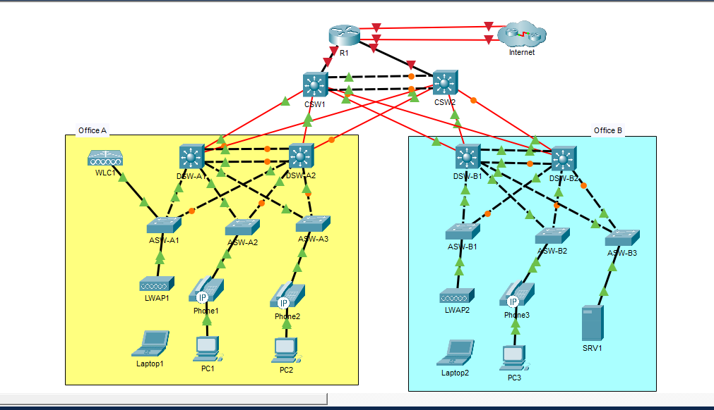

# CCNA Mega Lab – Jeremy's IT Lab

Personal lab documentation for the Jeremy's IT Lab CCNA Mega Lab series, built in Cisco Packet Tracer.

---

## Topology

### Device Inventory

| Device  | Role             | Site     | Type   |
|---------|------------------|----------|--------|
| R1      | Edge Router      | Core     | Router |
| CSW1    | Core Switch 1    | Core     | Switch |
| CSW2    | Core Switch 2    | Core     | Switch |
| DSW-A1  | Distribution A1  | Office A | Switch |
| DSW-A2  | Distribution A2  | Office A | Switch |
| ASW-A1  | Access A1        | Office A | Switch |
| ASW-A2  | Access A2        | Office A | Switch |
| ASW-A3  | Access A3        | Office A | Switch |
| DSW-B1  | Distribution B1  | Office B | Switch |
| DSW-B2  | Distribution B2  | Office B | Switch |
| ASW-B1  | Access B1        | Office B | Switch |
| ASW-B2  | Access B2        | Office B | Switch |
| ASW-B3  | Access B3        | Office B | Switch |

End devices (PCs, phones, laptops, APs, SRV1, WLC1) are not configured via CLI unless a specific part requires it.

---

## Lab Parts

| Part | Topic | Status |
|------|-------|--------|
| [Part 1](part1-initial-setup/report.md) | Initial Setup | ✅ |
| [Part 2](part2-VLANs-Layer-2EtherChannel/report.md) |  VLANs, Layer-2 EtherChannel | ⬜ |
| [Part 3](part3/report.md) | IP Addresses, Layer-3 EtherChannel, HSRP | ⬜ |
| [Part 4](part4/report.md) | Rapid Spanning Tree Protocol | ⬜ |
| [Part 5](part5/report.md) |  Static and Dynamic Routing | ⬜ |
| [Part 6](part6/report.md) | Network Services: DHCP, DNS, NTP, SNMP, Syslog, FTP, SSH, NAT | ⬜ |
| [Part 7](part7/report.md) | Security: ACLs and Layer-2 Security Features | ⬜ |
| [Part 8](part8/report.md) | IPv6 | ⬜ |
| [Part 9](part9/report.md) | Wireless & QoS | ⬜ |

---

## Notes

Background reference for commands and concepts used across multiple parts. Read once — not repeated in individual reports.

- [IOS Security Basics](notes/ios-security-basics.md) — password hashing, login local, exec-timeout, logging synchronous
- [IOS Fundamentals](notes/ios-fundamentals.md) — *(to be added)*
